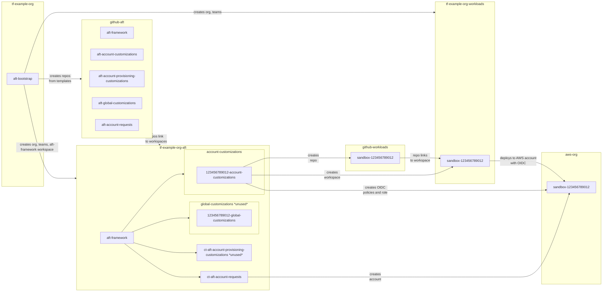

# aft-bootstrap

## Purpose: Lay down the base resources for aft-framework

1. Choose an email address for AFT
1. Create AFT HashiCorp user with that email
   1. Verify the email address
1. Create AFT GitHub user with that email
   1. Verify the email address
1. Create a repo called aft-bootstrap, using this repository as the template
1. Log in to Terraform Cloud with an owner account
1. If you haven't already, link Terraform to GitHub via personal oauth
1. Create a project called "AFT Bootstrap"
1. Create a workspace called aft-bootstrap
    1. Link the aft-bootstrap workspace to the new repo
1. Populate variables
    1. aft_email
        1. The email from step 2
    1. github_token
        1. This token can be attached to either the AFT GitHub user, or another account within the same organization
        1. The user that the token is attached to must have the ability to create repositories
        1. The token must have permission to create repositories
        1. Set token expiration to 1 hour
    1. tfe_token
        1. The user that  this token attached to must be a member of the Terraform Organization's "owner" team
        1. Set token expiration to 1 hour
1. Plan and Apply
1. Accept the invite to the Terraform organization in the AFT Hashicorp account (via email)

## Actions Taken
1. 5 GitHub repositories will be created in the same organization that the aft-bootstrap repository resides. These repositories will use robbycuenot/template-* repositories as a baseline, unless otherwise specified.
    - aft-account-customizations
    - aft-account-provisioning-customizations
    - aft-account-requests
    - aft-framework
    - aft-global-requests
1. The AFT Terraform user will be added to the organization, based off of aft_email
1. A new Terraform team called "aft-admins" will be created
1. The AFT Terraform user will be added to this team
1. A team token will be created on this team
1. A workspace called "aft-framework" will be created in the default project
    1. This workspace will be linked to the newly created "aft-framework" repository
    1. The team token will be stored as a secret on this workspace
    1. The repository names will be stored on this workspace as variables
    1. Empty variables for AWS Account IDs and AWS Credentials will be created
1. A new project will be created called "Workspaces"
1. The aft-admins team will be granted admin access to the default and Workspaces projects
